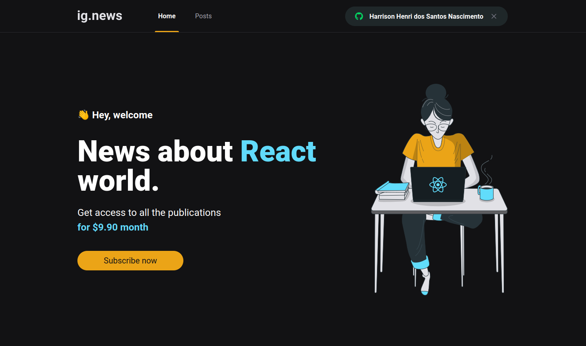
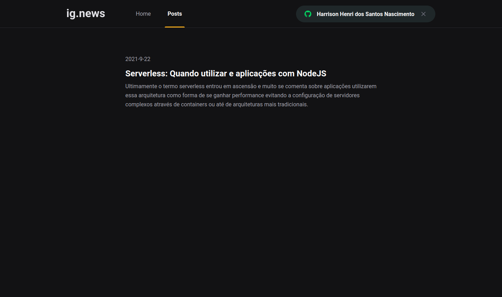
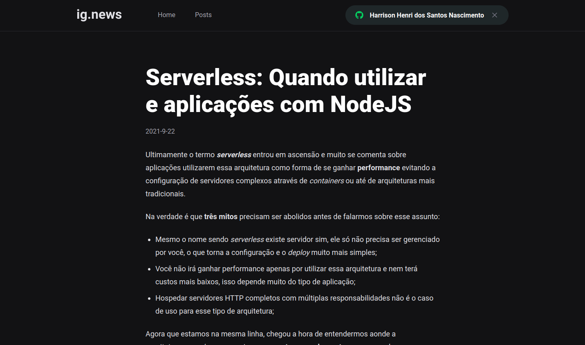
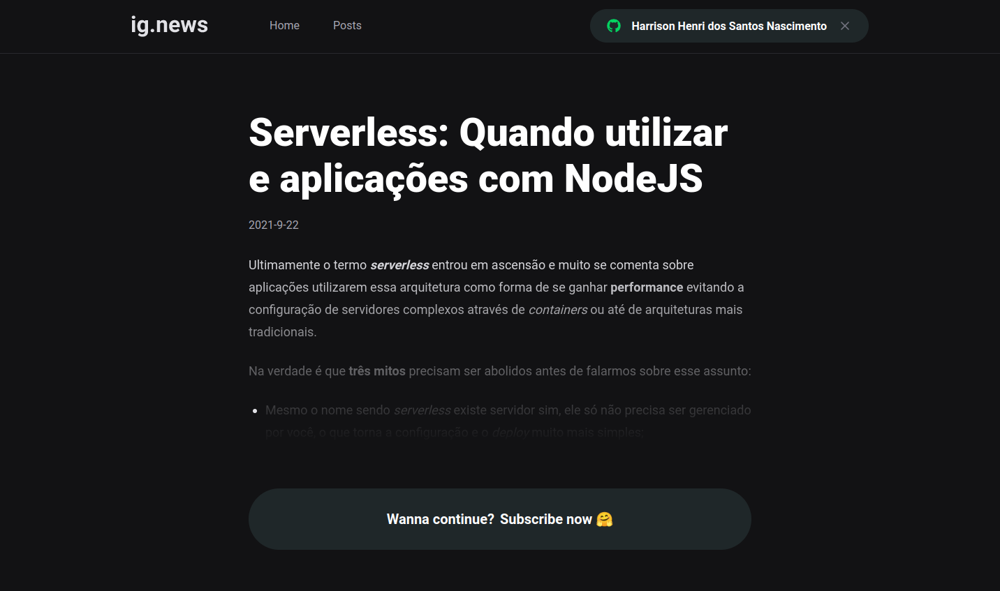
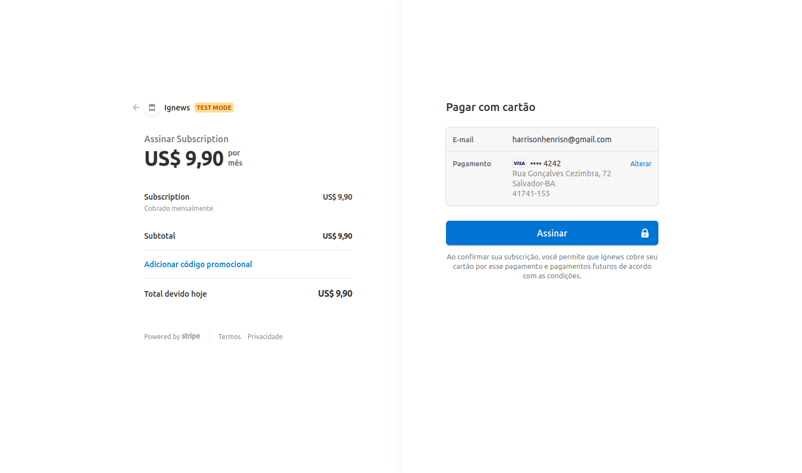

# Ignews

## About this Project

_"The objective of this project is to exercise some React and [Next.js](https://nextjs.org/) concepts as part of the [Ignite program](https://rocketseat.com.br/ignite)"._

## Why?

This project is part of my personal portfolio, so, I'll be happy if you could provide me any feedback about the project, code, structure or anything that you can report that could make me a better developer!

Email-me: harrisonhenrisn@gmail.com

Connect with me at [LinkedIn](https://linkedin.com/in/harrison-henri-dos-santos-nascimento).

Also, you can use this Project as you wish, be for study, be for make improvements or earn money with it!

It's free!

## Demo

To access the demo, please go to [https://ignews-harrisonhenri.vercel.app/](https://ignews-harrisonhenri.vercel.app/).

## Functionalities

- Home screen



- Posts screen



- Post screen



- Post preview screen



- Stripe screen



## Install

Clone the repo using

```
$ git clone https://github.com/HarrisonHenri/ignews.git
```

```
$ cd ignews
```

Install all the required dependencies

```
$ yarn
```

Then execute

```
$ yarn start
```

PS: You need also some settings of:

- [Prismic](https://prismic.io/)
- [Stripe](https://stripe.com/)
- [Github OAuth app](https://docs.github.com/en/developers/apps/building-oauth-apps/creating-an-oauth-app)

## Some concepts applied

- SSR - Server side rendering
- SSG - Static site generation
- Payment method with [stripe](https://stripe.com) and its cli
- Webhooks pattern
- JAMStack

## Built With

- [React](https://github.com/facebook/react) - Build the web app using JavaScript and React
- [Next.js](https://nextjs.org/)
- [Axios](https://github.com/axios/axios) - HTTP Client
- [Faunadb](https://fauna.com/)
- [Prismic](https://prismic.io/) - Headless CMS

## Contributing

You can send how many PR's do you want, I'll be glad to analyse and accept them! And if you have any question about the project...

Email-me: harrisonhenrisn@gmail.com

Connect with me at [LinkedIn](https://linkedin.com/in/harrison-henri-dos-santos-nascimento-a6ba33112).

Thank you!